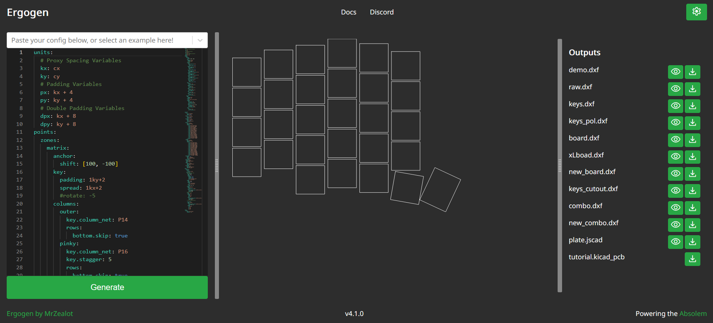
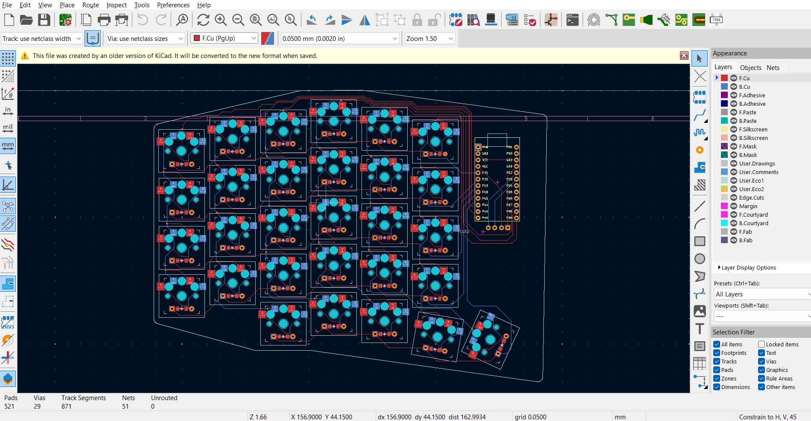

# Hood Keyboard 

This repositorty is for a split bluetooth keyboard that use the ZMK firmware and the ergogen tool

## Tools 

| Tools        | Prices |
| --------     | ------- |
| Iron solder  | x    |
| 3D printer   | x     |
| PLA   | x     |
| NiceNano     | 25€/piece   |
| JLCPCB       | 50€ for 5   |
| key switched | 20€/100   |
| key hotswap  | 10€/100   |

## Conception

The original conception has been made with ergogen that is a website to configure different keyboard by changing the key placements, the spacing and the number of keys.

The official [documentation](https://docs.ergogen.xyz/) is well build and still in progress.

You can find my configuration in the .yml file : [ergogen_config](ergogen_config.yaml)

## Electronics

For this split keyboard I used a single pcb design for both side by flipping it. By chance, ergogen format the conception directly with the footprint and just need to make the rooting to have a better.

This is a custom layout that I had by writing the space between my fingers and what spacing was better for me for the feeling.

## Printing

The issue with the Hood keyboard is that I re-shape the pcb and so is not conform anymore to the ergogen format made earlier. I used Fusion 360 to make a new 3D model and try to make a case to fit the keys, the battery and the microcontroler.

This step as taken me a lot tof time because not familiar with 3D printing

## Firmware

For the firmware I used the microcontroller nicenano!v2 that is a common microcontroler for keyboard. The advantage of it, it is compatible with ZMK firmware. A platform design to build single or split keyboards.

I encourage you to go see the [ZMK firmware documentation](https://zmk.dev/docs) right here to have better understanding or if you want to develop yourr own keyboard.

## Help / Ideas

Feel free to fork the project if you want to help with your design or ideas. It is always good to have feedback and advice on conceptions !

If you enconter a problem with the deployement of the code, you can open an issue.
